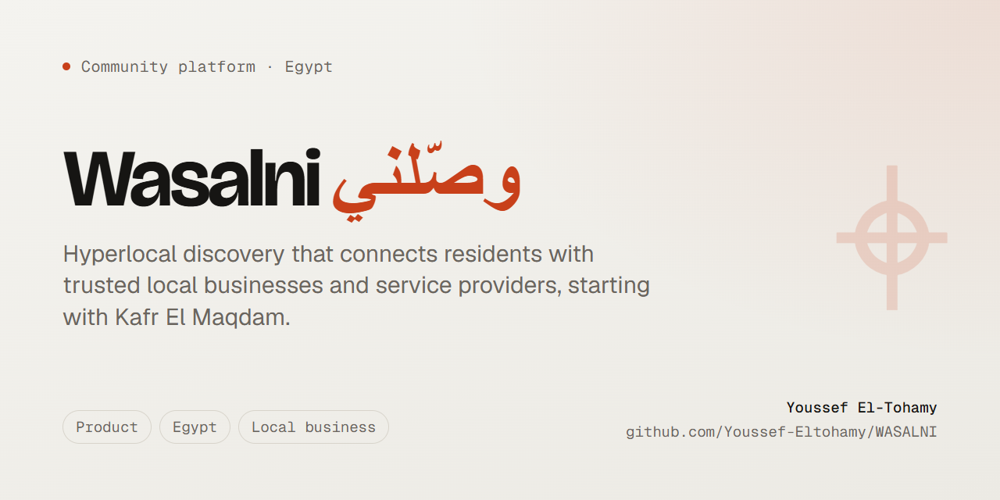

<div align="center">
  
</div>

<h3 align="center">وصّلني: منصة اكتشاف محلي تربط سكان القرى المصرية بالمحلات والحرفيين القريبين منهم.</h3>

<p align="center">
  
  
  
  
</p>

<p align="center">
  <a href="#ما-هو-وصّلني">ما هو وصّلني</a> ·
  <a href="#حالة-المشروع-الحالية">حالة المشروع</a> ·
  <a href="#هيكل-المشروع-monorepo">الهيكل</a> ·
  <a href="#البدء-setup">البدء</a> ·
  <a href="#الترخيص">الترخيص</a>
</p>

Wasalni is a hyperlocal discovery and connection platform for Egyptian communities, starting with Kafr El Maqdam village. This repository is currently a bootstrap monorepo (structure, tooling, and a placeholder DB schema): the product features described below are the plan, not yet the shipped state.

---

## ما هو وصّلني

منصة تربط سكان القرى المصرية بالمحلات والمنتجات والخدمات والحرفيين المحليين. نقطة الانطلاق: **قرية كفر المقدام** والقرى المجاورة.

> اكتشاف، بحث، وصول، تواصل مباشر، ثقة؛ وليس متجراً إلكترونياً أو منصة دفع.

## حالة المشروع الحالية

هذا الريبو فى مرحلة **bootstrap**: الهيكلة والتوولينج جاهزين، لكن معظم الكود لسه placeholder.

- `apps/mobile`: تطبيق Flutter بشاشة ترحيب واحدة بس (RTL، عربى بالكامل، ثيم أساسى). مفيش features حقيقية لسه.
- `apps/admin`: لوحة Next.js فيها صفحة واحدة بعنوان المشروع، لسه من غير أى منطق أو اتصال فعلى بالداتا.
- `supabase/migrations`: ملف schema واحد وهو placeholder صريح، بيقول إن الـ schema الفعلى هيتكتب فى إطار spec منفصلة (`docs/specs/001-authentication.md`)، وده مسار مش موجود فى الريبو لسه.
- `.specify/`: إعداد [Spec Kit](https://github.com/github/spec-kit) لمنهجية Spec-Driven Development، جاهز للاستخدام لما تبدأ أول spec.

بمعنى تانى: مفيش MVP شغال دلوقتى؛ الريبو ده هو نقطة البداية المتفق عليها (تكنولوجيا، بنية، دستور مشروع) قبل كتابة أى feature.

## هيكل المشروع (Monorepo)

```
wasalni/
├── apps/
│   ├── mobile/        # Flutter app (Android + iOS) - شاشة ترحيب فقط حالياً
│   └── admin/         # Next.js admin dashboard - صفحة عنوان فقط حالياً
├── supabase/
│   ├── migrations/    # SQL schema versions (placeholder حالياً)
│   ├── functions/     # Edge functions (فارغ حالياً)
│   └── seed.sql       # Initial data (فارغ حالياً)
├── .specify/           # Spec Kit configuration ودستور المشروع
└── docs/
    └── banner.png
```

## التكنولوجيا

| الطبقة | الاختيار |
| :-- | :-- |
| Mobile | Flutter |
| Admin Dashboard | Next.js + Tailwind + shadcn/ui |
| Backend | Supabase (PostgreSQL + Auth + Storage) |
| Methodology | Spec-Driven Development (Spec Kit) |
| اللغة | عربى فقط (RTL) فى الـ MVP |

## البدء (Setup)

### المتطلبات
- Flutter SDK
- Node.js v18+
- Git
- Supabase CLI
- حساب Supabase ومشروع متربط

### الخطوات

```powershell
# 1. Clone the repo
git clone https://github.com/Youssef-Eltohamy/WASALNI.git
cd WASALNI

# 2. Copy environment variables
copy .env.example .env
# Edit .env with real Supabase keys

# 3. Mobile app
cd apps\mobile
flutter pub get
flutter run

# 4. Admin dashboard (in another terminal)
cd apps\admin
npm install
npm run dev

# 5. Supabase (link to remote project)
supabase link --project-ref nseuurovkxymrwxamftz
supabase db push
```

## الخطة المستقبلية (MVP planned scope)

حسب دستور المشروع فى `.specify/memory/constitution.md`، النطاق المخطط للإصدار الأول:

تسجيل ودخول، تسجيل محل مجانى، التوثيق، صفحة المحل، منتجات بسيطة، Feed، بحث، أقسام ديناميكية، Admin Dashboard.

مؤجل عن قصد: الباقات المدفوعة، الإعلانات، التقييمات، البلاغات.

## منهجية التطوير

نتبع **Spec-Driven Development** عبر [GitHub Spec Kit](https://github.com/github/spec-kit):

```
/specify → /plan → /tasks → /implement
```

كل ميزة المفروض تبدأ بـ spec فى `docs/specs/NNN-feature-name.md` قبل أى كود؛ المجلد ده لسه مش موجود فى الريبو.

## الترخيص

Licensed under the [MIT License](LICENSE).
